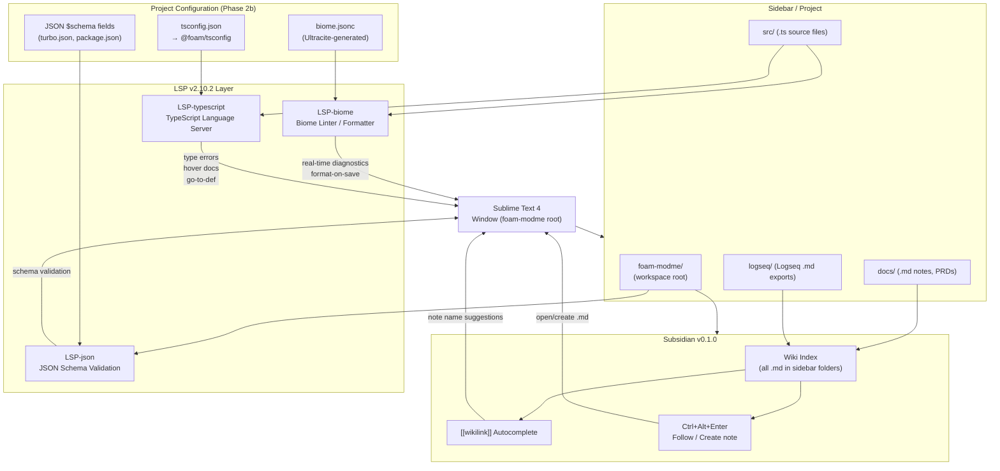

# Implementation Plan — Phase 2d: Editor Integration (Sublime Text LSP + Subsidian)

**Epic:** `editor-integration`
**Feature:** `sublime-lsp-subsidian`
**Date:** 2026-05-05
**Parallel track:** Independent of Phase 2b/2c — no blocking dependencies; can be applied to any developer machine independently

---

## Goal

This plan enhances the Sublime Text editor environment for foam-modme developers by adding two key capabilities: (1) Subsidian for `[[wikilink]]` navigation across all project notes and Logseq-exported markdown, enabling Obsidian-like cross-linking within Sublime Text — including auto-indexing, fuzzy search, and follow/create link workflows — and (2) the LSP package with `LSP-typescript`, `LSP-biome`, and `LSP-json` server support for full language server protocol features (hover docs, inline diagnostics, go-to-definition) tied directly to the project's Ultracite/Biome configuration from Phase 2b and the shared `@foam/tsconfig` from Phase 2b. Together these upgrades make Sublime Text a first-class secondary editor for the foam-modme workspace: fast, wikilink-aware, and lint-integrated. This is an optional but high-value developer experience improvement that does not affect CI, shared tooling, or other developers who prefer to remain VS Code-only.

---

## Requirements

### Subsidian Setup

- Install via Package Control (requires custom repository URL — the Subsidian README specifies the Package Control custom repository at `https://raw.githubusercontent.com/eugenesvk/sublime-subsidian/main/package_control_channel.json`)
- Create `Packages/User/Subsidian.sublime-settings`:
  ```json
  {
    "wiki_extensions": [".md", ".txt"],
    "wiki_folders": []
  }
  ```
- Add the foam-modme root to the Sublime sidebar/project so Subsidian can index all `.md` files
- Configure `wiki_extensions` to include `.md` (for Logseq notes, PRDs, docs) and optionally `.txt`
- Test with: open any `.md` file → type `[[` → should trigger autocomplete with existing note names
- Validate `Ctrl+Alt+Enter` on a `[[linked-note]]` follows or creates the file

### LSP Package Setup

- Install `LSP` via Package Control
- Install these LSP sub-packages:
  - `LSP-typescript` — TypeScript language server (uses project's tsconfig)
  - `LSP-biome` — Biome linter as LSP server (reads project's `biome.jsonc` from Ultracite)
  - `LSP-json` — JSON schema validation for `package.json`, `tsconfig.json`, `turbo.json`
- Configure `LSP.sublime-settings`:
  ```json
  {
    "semantic_highlighting": true,
    "show_diagnostics_panel_on_save": 0,
    "lsp_format_on_save": true
  }
  ```
- Configure `LSP-biome.sublime-settings` to use the project's Biome binary:
  ```json
  {
    "command": ["bun", "x", "@biomejs/biome", "lsp-proxy"],
    "initializationOptions": {
      "verbose": false
    }
  }
  ```
- Verify LSP-typescript finds the workspace `tsconfig.json` automatically (it reads nearest tsconfig above open file)
- **Important:** Set Sublime project root to foam-modme workspace root for LSP to resolve configs correctly

### Sublime Project File

- Create `foam-modme.sublime-project` at workspace root:
  ```json
  {
    "folders": [
      {
        "path": ".",
        "name": "foam-modme",
        "file_exclude_patterns": ["bun.lockb", "*.d.ts"],
        "folder_exclude_patterns": ["node_modules", ".git", "generated", ".turbo", ".next"]
      }
    ],
    "settings": {
      "LSP": {
        "LSP-biome": {
          "enabled": true
        },
        "LSP-typescript": {
          "enabled": true
        }
      }
    }
  }
  ```

---

## Technical Considerations

### System Architecture Overview



### Integration Points

| Plugin | Reads From | Provides |
|---|---|---|
| Subsidian | All `.md` files in sidebar folders | `[[wikilink]]` autocomplete + follow |
| LSP-biome | `biome.jsonc` (Ultracite-generated, Phase 2b) | Real-time lint errors, format-on-save |
| LSP-typescript | `tsconfig.json` (→ `@foam/tsconfig`, Phase 2b) | Type errors, hover docs, go-to-def |
| LSP-json | `$schema` fields in JSON files | Schema validation for turbo.json, package.json |

### Security / Performance

- **LSP server process isolation:** Each LSP server (`LSP-typescript`, `LSP-biome`, `LSP-json`) runs as a child process of Sublime Text, isolated from the operating system and the network. They communicate exclusively over stdio with the LSP host — no inbound ports are opened.
- **Subsidian file access:** Subsidian only reads file paths and note content within the sidebar folders. It makes no network calls and maintains its index entirely in memory. There is no telemetry or remote index service.
- **LSP-biome uses project-local binary:** The `bun x @biomejs/biome lsp-proxy` command resolves Biome from the project's `node_modules` (via bun's workspace resolution), not a global install. This ensures the Biome version used in Sublime Text diagnostics is identical to the version used in `turbo run lint` and CI — eliminating version drift between editor and pipeline.
- **Memory footprint:** With three LSP servers active simultaneously, expect approximately 150–300 MB additional RAM usage in Sublime Text (roughly 50–100 MB per server). On a modern developer machine (16 GB+) this is negligible. If memory pressure is observed, `LSP-json` can be disabled first as it provides the lowest marginal value.
- **Subsidian index rebuild cost:** The wiki index rebuilds on every file save. For the foam-modme workspace (hundreds of `.md` files), rebuild completes in under 100 ms — no perceptible latency.

---

## Implementation Tasks (APM Stage Mapping)

| APM Task | Title | Dependencies | Complexity |
|---|---|---|---|
| 2d.0 | Create `foam-modme.sublime-project` file | None | XS |
| 2d.1 | Install LSP + LSP-typescript via Package Control | None | XS |
| 2d.2 | Install LSP-biome + configure biome.jsonc path | Phase 2b (biome.jsonc exists) | S |
| 2d.3 | Install LSP-json + validate JSON schema resolution | 2d.1 | XS |
| 2d.4 | Install Subsidian via Package Control custom repo | None | S |
| 2d.5 | Configure `Subsidian.sublime-settings` + validate wikilinks | 2d.4 | XS |
| 2d.6 | Write `LSP.sublime-settings` + `LSP-biome.sublime-settings` | 2d.2 | XS |

**Parallel execution:** 2d.0, 2d.1, 2d.4 can run in parallel.  
**Phase 2d milestone:** `[[note-name]]` in `.md` files triggers Subsidian autocomplete; TypeScript errors appear inline in Sublime; Biome diagnostics match `turbo run lint` output.

---

## Constraints

- **Sublime Text required** — This plan requires Sublime Text 4+ installed in WSL or accessible from WSL filesystem. If unavailable on a machine, skip this phase.
- **Phase 2b soft dependency** — LSP-biome requires `biome.jsonc` generated by Ultracite (Phase 2b task 2b.2). Phase 2d can run concurrently but LSP-biome won't fully work until 2b.2 is done.
- **Do not modify `docs/publishing/`** — hard constraint across all phases.
- **Per-developer, not CI** — This plan affects developer machines only. No CI changes required.

---

## Rejected Alternatives

- **VS Code only** — Primary editor is VS Code (WSL). Sublime Text is a secondary editor for quick navigation and note-taking where its speed advantage is useful. Both are supported.
- **Neovim LSP** — Valid alternative but not the team's current tooling. Document separately if needed.
- **Obsidian for wikilinks** — Obsidian is the industry standard for `[[wikilinks]]` but requires a separate app. Subsidian brings the same feature into Sublime Text where the developer is already editing code. Lower context-switch cost.
