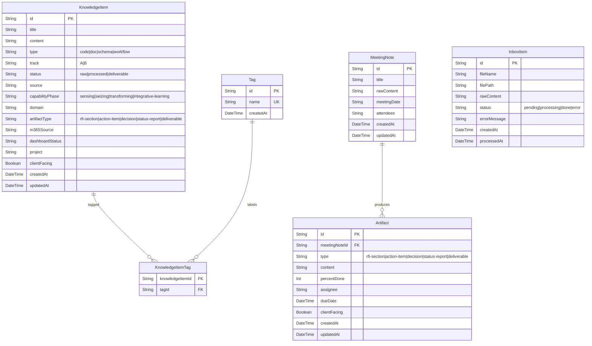
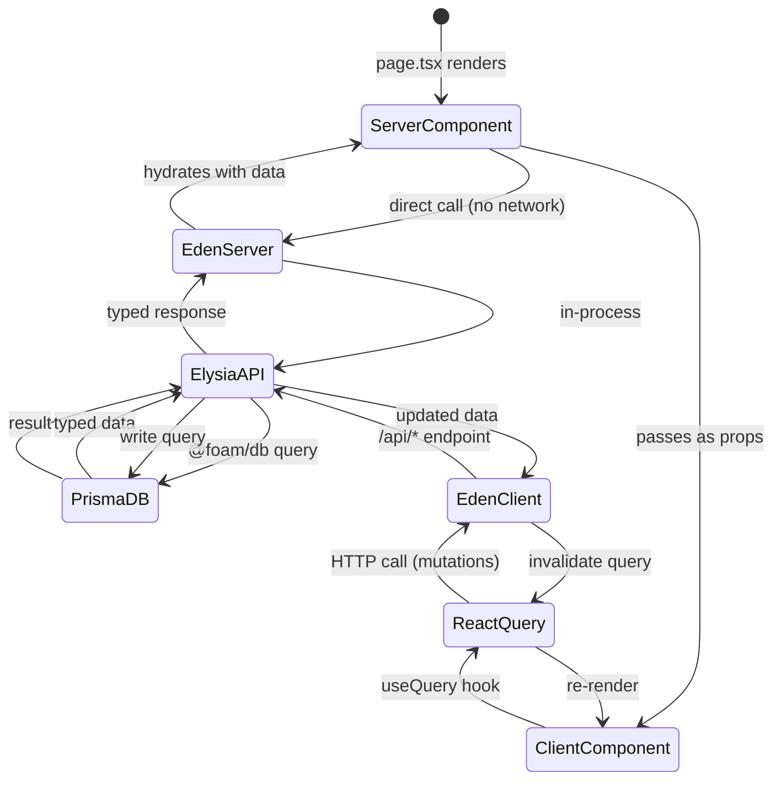

# Implementation Plan — Phase 2c: KM Platform DB Activation & Dashboard UI

**Epic:** `knowledge-platform`  
**Feature:** `phase-2c-db-dashboard`  
**Date:** 2026-05-05  
**Supersedes:** APM plan.md Stage 2 (partial) — architecture evolved from Wasp-monolith to Turborepo + Elysia

---

## Goal

Activate the Knowledge Management Platform by migrating from an in-memory, scaffold-only state to a live, database-backed system with a working dashboard UI. The implementation extracts the Prisma schema into a composable shared ORM package (`packages/db`), builds a Bun-native Elysia HTTP API (`services/km-api`) as the data layer, and delivers the first iterative dashboard (`apps/km-dashboard`) as an artefact for progressive refinement. All infrastructure uses Podman (not Docker) in compliance with company policy, with a PostgreSQL 16 stack managed via Podman Compose. The A.D.A.M. MCP server is upgraded with AgentCard and A2A Protocol support to become a fully discoverable agent in any A2A-compliant ecosystem.

---

## Requirements

### Monorepo Bootstrap

- Initialize Turborepo at `foam-modme/` root (add `turbo.json`, update `package.json` with workspaces + `bun` as package manager)
- Migrate from `package-lock.json` → `bun.lockb` at project root
- Add `$schema` to `turbo.json` for editor validation (`https://turbo.build/schema.json`)
- Define Turbo pipeline tasks: `build`, `dev`, `db:generate`, `db:migrate`, `db:deploy`
- `db:generate` must be declared as a `dependsOn` for both `build` and `dev` — prevents "missing Prisma client" errors
- Global env var: `DATABASE_URL` in `turbo.json` globalEnv

### Composable ORM Package (`packages/db`)

- Create `packages/db/` as `@foam/db` — the single source of truth for all Prisma schema, migrations, and generated client
- Migrate `knowledge-platform/schema.prisma` to `packages/db/prisma/schema.prisma`
- Set custom Prisma output path: `output = "../generated/prisma"` — required for correct type resolution across package managers
- Create singleton PrismaClient with globalThis guard (prevents connection explosion in dev hot-reload)
- Use `@prisma/adapter-pg` for PgBouncer-compatible connection pooling
- Export pattern: `src/index.ts` re-exports both singleton instance AND all generated types
- Package uses JIT packaging (`"exports": { ".": "./src/index.ts" }`) — no bundler required
- Add `generated/` to root `.gitignore`
- Include `prisma.config.ts` with explicit schema and migrations path declarations
- **Prisma 7 constraint:** `prisma migrate dev` no longer auto-generates the client; `db:generate` must be run explicitly after every schema change

### Podman Database Stack

- Replace `docker-compose.yml` PostgreSQL service with `podman-compose.yml` (knowledge-platform stack)
- **Critical fix:** Add host port mapping `5432:5432` — the existing docker-compose.yml has no host port mapping for postgres, making it unreachable from outside the internal network
- PostgreSQL 16-alpine, restart policy, healthcheck retained from existing config
- SecretSpec (`secretspec.toml`) — declare `DATABASE_URL`, `POSTGRES_USER`, `POSTGRES_PASSWORD`, `POSTGRES_DB` as required secrets with `development` profile defaults
- Provide `secretspec run -- bun run dev` pattern as standard dev startup command
- Keep n8n, Qdrant, and Ollama in a separate `podman-compose.services.yml` (infra services remain independent)
- Document Podman Compose installation in `devenv.nix` (add `podman-compose` to packages)

### Elysia API Server (`services/km-api`)

- Create `services/km-api/` as a standalone Bun workspace package (`@foam/km-api`)
- Depends on `@foam/db` — consumes the composable ORM package
- Elysia instance with `prefix: '/api'` — enables optional embedding in Next.js route handler
- Route groups: `/api/knowledge`, `/api/inbox`, `/api/tags`, `/api/artifacts`, `/api/agents`
- Eden type export: `export type App = typeof app` — enables zero-codegen type-safe client in dashboard
- Built-in OpenAPI generation via `@elysia/openapi` plugin
- Standard Schema interop: Zod v4 for request/response validation
- Vercel deployment: default export of Elysia instance + `"bunVersion": "1.x"` in `vercel.json`
- Environment: `secretspec run -- bun run dev` startup; reads `DATABASE_URL` from SecretSpec or env

### KM Dashboard (`apps/km-dashboard`)

- Create `apps/km-dashboard/` as a Next.js 15 App Router application
- Uses Elysia Eden treaty client for type-safe API calls (replaces tRPC)
- Server-side: Eden treaty calls `services/km-api` directly (no network hop)
- Client-side: Eden treaty calls via HTTP to the deployed API URL
- Component library: `shadcn/ui` — consistent with existing React 19 ecosystem in foam-modme
- Dashboard pages (iterative artefacts — not final product):
  - **Knowledge Browser** — list/filter KnowledgeItems by track, phase, status; search
  - **Inbox Dashboard** — list raw InboxItems, trigger ingest action
  - **Artifact Tracker** — Track B artifact table, status pipeline visualization
  - **Tag Editor** — taxonomy management, tag merge/rename
- Tailwind v4, TypeScript strict, Biome 2 for lint/format (replace ESLint/Prettier)
- State management: React Query (TanStack Query) for server state; no Zustand in Phase 2c

### A.D.A.M. Server Upgrade

- Move `examples/adam-server/` → `apps/adam-server/` (promote from examples to first-class app)
- Add AgentCard served at `GET /.well-known/agent.json` — makes A.D.A.M. discoverable by any A2A-compliant client
- AgentCard content: agent name, description, version, endpoint URL, skills list, A2A capabilities declaration
- Integrate `@foam/db` for persistent knowledge storage (replace in-memory `KnowledgeItem[]` array)
- Add SecretSpec support for `DATABASE_URL`
- Defer full A2A task endpoint implementation to Stage 3 — Phase 2c adds the AgentCard only

### Schema Documentation

- Add `json-schema-for-humans` as a Python dev tool in `devenv.nix` (via `python3Packages.json-schema-for-humans` or pip in devenv shell)
- Add `docs:schema` Turbo task that generates Markdown docs from Prisma-exported JSON Schema
- Output: `docs/ways-of-work/data/schema-reference.md` — auto-generated, gitignored

---

## Technical Considerations

### System Architecture Overview

```mermaid
graph TB
    subgraph FE["Frontend Layer — apps/km-dashboard"]
        KB[Knowledge Browser Page]
        ID[Inbox Dashboard Page]
        AT[Artifact Tracker Page]
        TE[Tag Editor Page]
        Eden[Eden Treaty Client]
    end

    subgraph API["API Layer — services/km-api (Elysia on Bun)"]
        Router[Elysia Router :3001]
        KR[/api/knowledge]
        IR[/api/inbox]
        TR[/api/tags]
        AR[/api/artifacts]
        AGR[/api/agents]
        OA[OpenAPI /api/swagger]
        ZV[Zod v4 Validation]
    end

    subgraph BL["Business Logic Layer"]
        KS[KnowledgeService]
        IS[InboxService]
        AS[ArtifactService]
        TS[TagService]
    end

    subgraph DL["Data Layer — packages/db (@foam/db)"]
        PC[PrismaClient Singleton]
        SM[schema.prisma]
        GC[Generated Client /generated/prisma]
        PGA[adapter-pg / PgBouncer]
    end

    subgraph IL["Infrastructure Layer"]
        PG[(PostgreSQL 16\nPodman :5432)]
        SS[SecretSpec\nsecretspec.toml]
        PC2[Podman Compose\npodman-compose.yml]
        ADAM[apps/adam-server\nA.D.A.M. MCP + AgentCard]
        VS[Vercel\nkm-api deployment]
    end

    KB & ID & AT & TE --> Eden
    Eden -->|HTTP / direct server call| Router
    Router --> KR & IR & TR & AR & AGR
    KR & IR --> ZV
    ZV --> KS & IS & AS & TS
    KS & IS & AS & TS --> PC
    PC --> PGA --> PG
    SM --> GC --> PC
    SS --> PG
    PC2 --> PG
    ADAM -->|@foam/db| PC
    Router -->|export default| VS
```

**Technology Stack Rationale:**

| Layer | Choice | Rationale |
|---|---|---|
| API | Elysia on Bun | 17× faster than Express/Node; Bun-native JIT; WinterTC (runs on Vercel/CF Workers); Eden = zero-codegen type safety |
| ORM | Prisma 7 via `@foam/db` | Official Turborepo guide; composable singleton; `adapter-pg` for connection pooling; `prisma mcp` for Copilot context |
| Frontend | Next.js 15 + shadcn/ui | React ecosystem consistency (foam-modme already React 19); Server Components for performance; Eden isomorphic client |
| Type Safety | Zod v4 + Eden | Standard Schema interop in Elysia; Eden carries types end-to-end including error branches |
| Secrets | SecretSpec (v0.8) | Commits secret contract to git; `--provider dotenv` bridge for local dev; `secretspec check` for onboarding |
| Infrastructure | Podman Compose | Company policy: no Docker; Podman is drop-in compatible |
| Schema Docs | json-schema-for-humans | Python CLI; generates Markdown from Prisma schema JSON; Turbo-cache friendly |

### Database Schema Design



**Indexing strategy:**

| Index | Table | Field(s) | Rationale |
|---|---|---|---|
| `idx_ki_track_status` | KnowledgeItem | `(track, status)` | Primary filter in Knowledge Browser |
| `idx_ki_capabilityphase` | KnowledgeItem | `capabilityPhase` | Track A phase-based filtering |
| `idx_ki_type` | KnowledgeItem | `type` | Type facet filter |
| `idx_artifact_type` | Artifact | `type` | Artifact Tracker filter by type |
| `idx_inboxitem_status` | InboxItem | `status` | Inbox queue processing queries |
| `idx_tag_name` | Tag | `name` | Tag Editor autocomplete search |

**Migration strategy:**

- Migrations versioned in `packages/db/prisma/migrations/` — source-controlled
- `turbo run db:migrate` for schema updates
- `turbo run db:deploy` for production deploys (runs `prisma migrate deploy` — no interactive prompts)
- Initial migration named `0001_knowledge_platform_foundation`

### API Design

#### Base URL

- Development: `http://localhost:3001/api`
- Production: `https://km-api.vercel.app/api`

#### Endpoints

**Knowledge Items**

```
GET    /api/knowledge            — list with filters: ?track=A&status=processed&phase=sensing&type=doc&tag=<name>
POST   /api/knowledge            — create new item (body: KnowledgeItemInput)
GET    /api/knowledge/:id        — get single item
PATCH  /api/knowledge/:id        — update item (partial body)
DELETE /api/knowledge/:id        — delete item
POST   /api/knowledge/:id/tags   — add tags (body: { tags: string[] })
DELETE /api/knowledge/:id/tags   — remove tags (body: { tags: string[] })
```

**Inbox**

```
GET    /api/inbox                — list items, optional ?status=pending
POST   /api/inbox/ingest         — trigger ingest for a pending item (body: { id: string })
POST   /api/inbox/ingest-all     — batch ingest all pending items
DELETE /api/inbox/:id            — remove inbox item
```

**Tags**

```
GET    /api/tags                 — list all tags with usage counts
POST   /api/tags                 — create new tag
PATCH  /api/tags/:id             — rename tag
DELETE /api/tags/:id             — delete tag (unlinks from all KnowledgeItems)
POST   /api/tags/merge           — merge two tags (body: { from: string; into: string })
```

**Artifacts**

```
GET    /api/artifacts            — list artifacts, optional ?type=action-item&assignee=<name>&clientFacing=true
GET    /api/artifacts/:id        — get single artifact
PATCH  /api/artifacts/:id        — update (percentDone, assignee, dueDate)
```

**Agents (A.D.A.M. discovery)**

```
GET    /.well-known/agent.json   — AgentCard (public, no auth)
GET    /api/agents               — list registered agents
```

**TypeScript types (pseudocode — not implementation):**

```typescript
// Core types exported from @foam/db
type Track = 'A' | 'B'
type Status = 'raw' | 'processed' | 'deliverable'
type CapabilityPhase = 'sensing' | 'seizing' | 'transforming' | 'integrative-learning'
type ArtifactType = 'rfi-section' | 'action-item' | 'decision' | 'status-report' | 'deliverable'

// API response envelope
type ApiResponse<T> = { data: T } | { error: { code: string; message: string } }

// Eden App type (inferred from Elysia routes — enables zero-codegen client)
type App = typeof app  // exported from services/km-api/src/index.ts
```

**Error handling:**

| Code | HTTP Status | Meaning |
|---|---|---|
| `KM_NOT_FOUND` | 404 | Item does not exist |
| `KM_VALIDATION` | 422 | Request body failed Zod validation |
| `KM_DB_ERROR` | 500 | Prisma query failed |
| `KM_INGEST_BLOCKED` | 409 | Ingest already in progress for this item |

**Authentication:** Deferred to Stage 3 (no auth in Phase 2c). All endpoints are unauthenticated local-network-only in Phase 2c.

**Rate limiting:** Not applicable in Phase 2c (single-developer local deployment).

**OpenAPI:** Auto-generated by `@elysia/openapi`. Available at `/api/swagger` in development.

### Frontend Architecture

#### Component Hierarchy

```
apps/km-dashboard/
└── app/                          (Next.js App Router)
    ├── layout.tsx                (root layout: sidebar nav + theme)
    ├── page.tsx                  (redirect → /knowledge)
    ├── knowledge/
    │   └── page.tsx              (KnowledgeBrowserPage)
    ├── inbox/
    │   └── page.tsx              (InboxDashboardPage)
    ├── artifacts/
    │   └── page.tsx              (ArtifactTrackerPage)
    └── tags/
        └── page.tsx              (TagEditorPage)

components/
├── layout/
│   ├── AppSidebar.tsx            (shadcn/ui: Sheet + NavigationMenu)
│   └── TopBar.tsx                (page title + action buttons)
├── knowledge/
│   ├── KnowledgeItemCard.tsx     (shadcn/ui: Card)
│   ├── KnowledgeItemTable.tsx    (shadcn/ui: DataTable via TanStack Table)
│   ├── TrackFilter.tsx           (shadcn/ui: Select/Tabs: Track A | Track B)
│   ├── PhaseFilter.tsx           (shadcn/ui: Badge-group filter)
│   ├── StatusFilter.tsx          (shadcn/ui: Select: raw|processed|deliverable)
│   └── KnowledgeSearchBar.tsx    (shadcn/ui: Input + CommandMenu)
├── inbox/
│   ├── InboxItemRow.tsx          (shadcn/ui: Table row)
│   └── IngestButton.tsx          (shadcn/ui: Button with loading state)
├── artifacts/
│   ├── ArtifactTable.tsx         (shadcn/ui: DataTable — sortable by percentDone/dueDate)
│   └── StatusPipelineViz.tsx     (visual flow: raw→processed→deliverable; CSS Flexbox)
└── tags/
    ├── TagList.tsx               (shadcn/ui: Badge list with delete)
    └── TagMergeDialog.tsx        (shadcn/ui: Dialog + ComboBox)
```

#### State Flow



**State management patterns:**

- **Server state:** React Query (TanStack Query v5) — all API fetches, mutations, and cache invalidation
- **UI state:** React `useState` / `useReducer` — filter selections, dialog open/close, search input
- **No global store (Zustand)** in Phase 2c — complexity deferred to Stage 3

### Security Performance

**Authentication / Authorization (Phase 2c):**

- No auth implemented in Phase 2c — API is local-network-only
- Preparing for auth: API routes designed with auth middleware injection points
- Stage 3 will add Better Auth or Wasp auth

**Data validation:**

- All API inputs validated with Zod v4 schemas at the Elysia route level
- Elysia's `t` type builder validates at both compile time AND runtime (Standard Schema interop)
- Database writes always go through Zod-validated typed input — no raw user strings to Prisma

**Environment secrets:**

- `DATABASE_URL` never hardcoded — always from `secretspec run` or env var
- `secretspec.toml` committed to git (declares requirement, not values)
- `.env` files gitignored
- SecretSpec `dotenv` provider used in development as bridge until team adopts a secrets backend

**Performance optimization:**

- Prisma `adapter-pg` with PgBouncer-compatible connection pooling
- Singleton PrismaClient guarded by `globalThis` — prevents N connections in dev hot-reload
- `db:generate` output cached by Turbo (inputs: `schema.prisma` → outputs: `generated/`)
- Next.js Server Components for initial page render — knowledge list hydrated server-side
- React Query `staleTime: 30_000` for knowledge item lists (low mutation rate data)

**Podman security:**

- PostgreSQL container runs as non-root (Podman rootless mode by default)
- Postgres credentials injected via SecretSpec, not hardcoded in `podman-compose.yml`
- Health check retained: `pg_isready` probe before marking container healthy

---

## Implementation Tasks (APM Stage Mapping)

| APM Task | Title | Dependencies | Complexity |
|---|---|---|---|
| 2.0 | Monorepo bootstrap (turbo.json + bun workspaces) | Stage 1 complete | S |
| 2.1 | Create `packages/db` (@foam/db) | 2.0 | M |
| 2.2 | Podman DB stack + SecretSpec | 2.0 | S |
| 2.3 | Create `services/km-api` (Elysia) | 2.1, 2.2 | M |
| 2.4 | Create `apps/km-dashboard` (Next.js) | 2.3 | M |
| 2.5 | Upgrade A.D.A.M. → `apps/adam-server` with AgentCard | 2.1, 2.2 | S |
| 2.6 | Schema docs (json-schema-for-humans) | 2.1 | XS |

**Parallel execution:** Tasks 2.2, 2.4, 2.5, 2.6 can run in parallel once 2.1 is complete. Task 2.3 is the critical path (Elysia routes must exist before dashboard Eden client can be typed).

---

## Open Decisions

| Decision | Options | Impact |
|---|---|---|
| Dashboard UI framework | Next.js + shadcn/ui (React) vs Nuxt 3 + Nuxt UI (Vue) | Recommend Next.js: ecosystem consistency. Nuxt UI valid if Vue isolation is intentional. |
| Wasp `knowledge-platform` fate | Keep as Phase 1 reference vs deprecate | Keep for now; new dashboard is the active UI. Deprecation in Stage 3. |
| Full A2A endpoint in Phase 2c? | AgentCard only vs AgentCard + tasks/send | AgentCard only in Phase 2c; full A2A in Stage 3. |
| Auth timing | Phase 2c (no auth) vs Stage 3 | Deferred to Stage 3 per original plan. Phase 2c is single-user local. |

---

## Rejected Alternatives

- **Docker Compose** — company policy prohibits Docker. Podman Compose is the approved substitute.
- **tRPC** — Eden provides equivalent type safety with less configuration overhead and no codegen step.
- **Qdrant for knowledge search** — Prisma full-text search via PostgreSQL sufficient for Phase 2c scale. Qdrant integration deferred.
- **Turborepo schema gen crate** — Internal Vercel tooling only; not a project consumer tool. Use `$schema` in `turbo.json` for editor validation instead.
