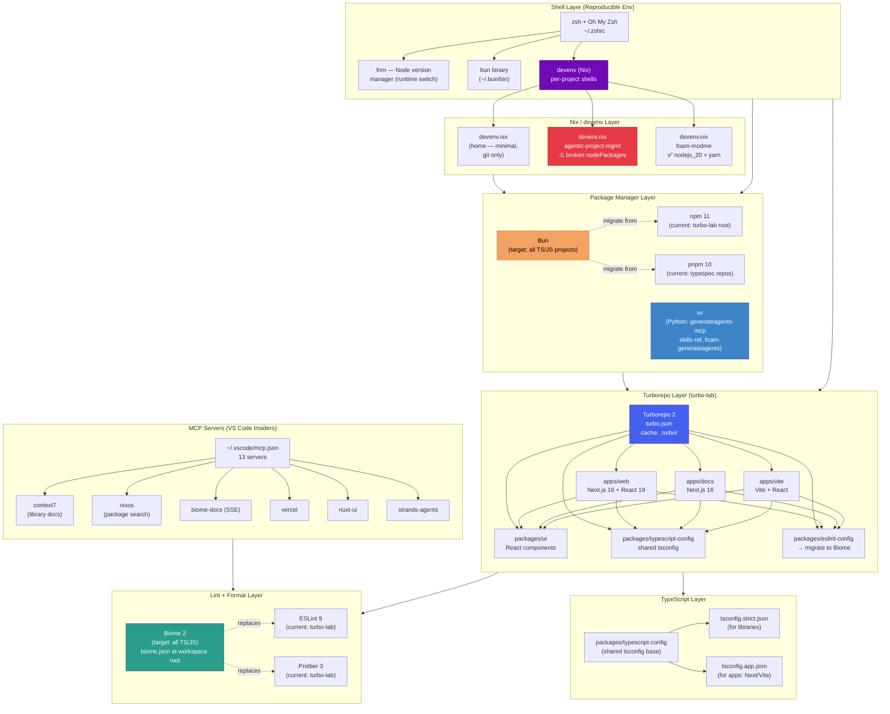

# Tool Harmonization — Epic Architecture Specification

**Epic:** Harmonize frontend development, package management, NixOS/devenv, and Turborepo tooling across all projects in the `/home/wsl-vm` workspace.

---

## 1. Epic Architecture Overview

The workspace currently has **four competing toolchain contexts** operating independently, creating friction, version drift, and duplicated configuration:

| Context | Package Manager | Node Version | Lint/Format | Shell Env |
|---------|----------------|-------------|-------------|-----------|
| `turbo-lab` (mono) | npm 11 + bun.lock | ≥18 (no pin) | ESLint 9 + Prettier | nvm/fnm |
| `agentic-project-management-modme` examples | bun (build scripts) | inferred | — | devenv.nix |
| `foam-modme`, `memento`, `agentic` (typespec) | pnpm 10 | node 20 | — | devenv.nix (broken: `nodePackages` removed) |
| Python projects (generateagents-mcp, skills-ref) | pip / uv | — | — | uv venv per-project |

**Goal:** Establish a single consistent toolchain contract across all JS/TS workspaces using **Bun as the universal JS runtime/package manager**, **Biome as the unified linter+formatter** (replacing ESLint + Prettier), **devenv (Nix) as the reproducible shell layer**, and **Turborepo 2 as the task orchestration layer** for monorepo builds.

---

## 2. System Architecture Diagram



---

## 3. High-Level Features & Technical Enablers

### Features

1. **Universal Bun adoption** — Replace npm/pnpm as the JS package manager across turbo-lab and all example projects. Add `bun.lock` and `"packageManager": "bun@1.x"` to all relevant `package.json` files.

2. **Biome as unified lint+format** — Replace ESLint + Prettier in turbo-lab with a single `biome.json` at the repo root. Migrate the `packages/eslint-config` shared package to a `packages/biome-config` shared config. Remove `eslint-config-prettier`.

3. **devenv.nix repair and standardization** — Fix the broken `nodePackages.npm` / `nodePackages.yarn` references in `agentic-project-management-modme/devenv.nix`. Establish a canonical devenv template with: `nodejs_20`, `bun`, `uv`, `git`, `gh`, `jq`, `ripgrep`.

4. **Turborepo Bun integration** — Switch turbo-lab's `packageManager` field from `npm@11` to `bun@1.x`. Validate `bun.lock` is the source of truth (already present). Add `TURBO_TELEMETRY_DISABLED=1` to `.env.local`.

5. **Shared TypeScript config promotion** — Expose `packages/typescript-config` base configs (`strict`, `app`, `library`) to all projects that use ad-hoc tsconfig files.

6. **Python toolchain unification** — All Python projects (`generateagents-mcp`, `skills-ref`) already use `uv` with `pyproject.toml` and `requires-python >= 3.12`. Standardize on `uv sync` + `uv run` as the only entry points. Add a shared `.python-version` file pinning 3.12.

7. **Node version pinning** — Replace loose `"engines": {"node": ">=18"}` with FNM-managed pinning: add `.node-version` = `20` to turbo-lab root. The existing `.nvmrc` in prompt-registry (`v20`) becomes the template.

8. **MCP server health watcher** — Extend `mcp-status.sh` to report Biome MCP and nixos MCP connectivity as part of the toolchain health check.

### Technical Enablers

| Enabler | Purpose | Effort |
|---------|---------|--------|
| `biome.json` at turbo-lab root | Single source of truth for lint + format rules | S |
| `packages/biome-config/` package | Shareable Biome config for monorepo consumers | S |
| `devenv.nix` canonical template | Reproducible shell for all JS+Python projects | M |
| `bun.lock` migration in turbo-lab | Correct lockfile for Bun package manager | S |
| `.node-version` pin files | Consistent node across nvm/fnm environments | XS |
| `packages/typescript-config` consumption | Remove per-project tsconfig duplication | M |
| `uv.lock` verification in Python projects | Ensure reproducible Python installs | S |

---

## 4. Technology Stack

### JavaScript / TypeScript

| Tool | Role | Status |
|------|------|--------|
| **Bun 1.x** | Package manager + runtime + test runner | Target (migrate from npm/pnpm) |
| **Turborepo 2** | Task orchestration + remote caching | Active (`turbo-lab`) |
| **Next.js 16** | App framework (`apps/web`, `apps/docs`) | Active |
| **Vite 6 + React** | App framework (`apps/vite`) | Active |
| **TypeScript 5.9** | Language (all workspaces) | Active |
| **Biome 2** | Lint + format (replaces ESLint 9 + Prettier 3) | Target |
| **ESLint 9** | Lint (current turbo-lab) | Migrate out |
| **Prettier 3** | Format (current turbo-lab) | Migrate out |

### Shell / Environment

| Tool | Role | Status |
|------|------|--------|
| **devenv (Nix)** | Reproducible per-project shells | Active (3 devenv.nix files) |
| **fnm** | Node version switching | Active (lazy-loaded in `.zshrc`) |
| **nvm** | Node version manager (legacy) | Present (coexists with fnm) |
| **zsh + Oh My Zsh** | Interactive shell | Active |

### Python

| Tool | Role | Status |
|------|------|--------|
| **uv** | Package manager + virtualenv | Active (all Python projects) |
| **Python 3.12** | Runtime | Active (`requires-python >= 3.12`) |

### MCP Servers (VS Code Insiders)

| Server | Purpose |
|--------|---------|
| `context7` | Library/API documentation fetch |
| `strands-agents` | Strands agent SDK docs |
| `vercel` | Deployment management |
| `nuxt-ui` | Nuxt UI component reference |
| `shadcnvue` | shadcn/vue component reference |
| `heroui-native` | HeroUI Native mobile components |
| `nixos` | Nix package/option search |
| `biome-docs` (SSE) | Biome configuration docs |
| `graphql-yoga-docs` (SSE) | GraphQL Yoga docs |
| `mcp-ui-docs` | MCP App UI docs |
| `elysia-docs` (SSE) | Elysia HTTP framework docs |
| `next-devtools` | Next.js DevTools |
| `gitkraken` | Git workflow |

---

## 5. Technical Value

**High.**

- Eliminating the npm/pnpm split removes ambiguity in CI and developer onboarding — everyone runs `bun install` everywhere.
- Replacing ESLint + Prettier with Biome cuts ~15 dev-dependency packages from turbo-lab, speeds up lint runs by ~10×, and removes the formatter/linter config mismatch surface.
- Fixing `devenv.nix` files means `devenv shell` actually works for contributors without manual intervention.
- Pinning `.node-version` prevents FNM/nvm from silently using a mismatched Node version, which historically caused the VS Code terminal exit-code-1 problem.
- Python standardization on `uv` is already mostly complete; codifying it as a policy closes the gap.

---

## 6. T-Shirt Size Estimate

**M (Medium)**

- Bun migration in turbo-lab: **S** (change packageManager, test `bun install`)
- Biome adoption + ESLint removal: **M** (new config, fix warnings, remove old packages)
- devenv.nix repairs + canonicalization: **S** (known fix: swap `nodePackages.*` → top-level)
- Node version pinning: **XS** (add `.node-version` files)
- TypeScript config sharing: **M** (audit and update per-project tsconfigs)
- Python uv policy documentation: **XS**

Total: **~1–2 focused sprints** of coordinated changes across 3–4 repos. No breaking API changes; all changes are configuration/toolchain only.

---

## 7. Current Friction Map (Reference)

```
Problem                          Root Cause                       Fix
─────────────────────────────────────────────────────────────────────────────
turbo-lab uses npm despite       packageManager = npm@11 but      Change to bun@1.x; bun.lock
bun.lock already present         bun.lock committed               already exists ✅

agentic devenv.nix fails eval    nodePackages.npm removed in      Replace with nodejs_20 + yarn
                                 nixpkgs (known break)            (same as foam-modme fix)

No shared Biome config           ESLint + Prettier split          Introduce packages/biome-config

Node version inconsistency       fnm + nvm both in .zshrc,       Add .node-version = 20 to
between projects                 no per-project pin               turbo-lab and apm projects

Python projects not documented   uv used but no workspace-level  Add .python-version = 3.12
as uv-first                      policy                          + document in AGENTS.md
```

---

## 8. Implementation Sequence

```
Phase 1 — Quick wins (< 1 day)
  ├── Fix agentic-project-management-modme/devenv.nix (nodePackages → top-level)
  ├── Add .node-version = 20 to turbo-lab/
  └── Add .python-version = 3.12 to Python project roots

Phase 2 — Bun migration (1 day)
  ├── Change turbo-lab packageManager to bun@1.x
  ├── Run bun install; verify bun.lock is consistent
  └── Update turbo-lab CI scripts (if any) to use bun

Phase 3 — Biome adoption (1–2 days)
  ├── Install @biomejs/biome in turbo-lab root
  ├── Run biome migrate --write to auto-convert ESLint rules
  ├── Create packages/biome-config/ shared config
  ├── Wire biome lint + biome format into turbo.json tasks
  └── Remove eslint, prettier, eslint-config-prettier packages

Phase 4 — TypeScript config audit (1 day)
  ├── Audit agentic/foam-modme ad-hoc tsconfigs
  └── Extend packages/typescript-config where applicable

Phase 5 — Documentation
  └── Update AGENTS.md home + projects with confirmed toolchain table
```
