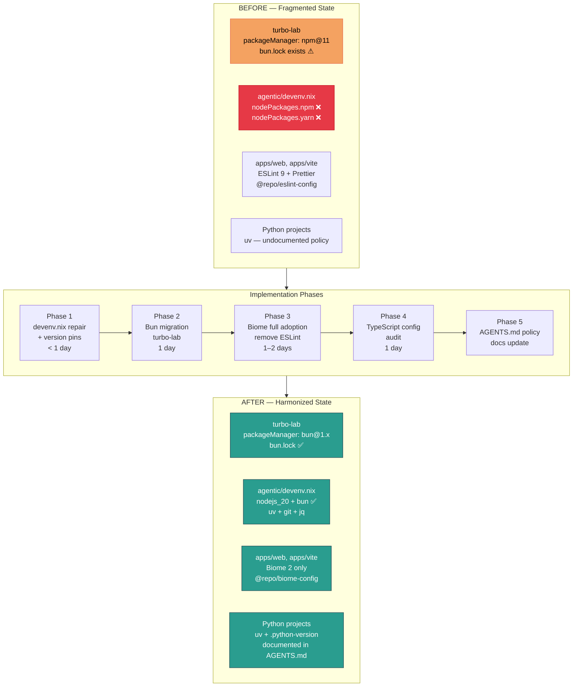
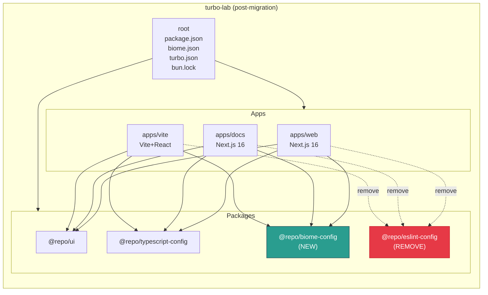

# Implementation Plan — Tool Harmonization Epic

**Epic:** `tool-harmonization`
**Feature:** Full-stack toolchain convergence (Bun + Biome + devenv + TypeScript)
**Plan location:** `docs/ways-of-work/plan/tool-harmonization/implementation-plan.md`
**Architecture spec:** [`arch.md`](./arch.md)
**Created:** 2026-05-04
**Owner:** WSL workspace

---

## Goal

Establish a single, reproducible toolchain contract across all JavaScript/TypeScript and Python projects in `/home/wsl-vm`. The core contract is: **Bun** as the universal JS runtime and package manager, **Biome 2** as the single lint+format tool (replacing the ESLint + Prettier split), **devenv (Nix)** for reproducible per-project shells, and **Turborepo 2** for task orchestration. This eliminates the current four-way fragmentation where `turbo-lab` uses npm, `typespec` repos use pnpm, `agentic` devenv.nix is broken, and lint/format rules differ by directory. The result is: any developer entering any JS project runs `bun install && bun run dev`; any Nix user runs `devenv shell`; both succeed without manual intervention.

---

## Requirements

### Functional

- `turbo-lab` must boot with `bun install` (not `npm install`) and produce no lockfile conflicts
- `bun run build`, `bun run lint`, `bun run check`, `bun run dev` must all work from `turbo-lab/`
- `devenv shell` must succeed in `agentic-project-management-modme/` without `nodePackages` errors
- Every JS/TS workspace in turbo-lab must use Biome for lint + format (no per-app ESLint config needed)
- Node version 20 must be pinned via `.node-version` for FNM auto-switching
- Python 3.12 must be the declared minimum across all Python project roots

### Non-functional

- No breaking changes to app source code — only configuration and toolchain files change
- Biome rules must be equivalent to (or stricter than) existing ESLint recommended rules
- All Turbo cache keys remain valid — `turbo.json` task shapes must not break existing `.turbo/` cache
- The empty `.npmrc` must be removed (Bun does not use `.npmrc`)
- devenv fixes must not remove packages that are actively used (check before delete)

### Out of Scope

- Migrating `projects/Data/Nux` or `Data/Docs/nuxt-docs` from pnpm (separate project, separate team conventions)
- Changing app source code (React components, Next.js routes, etc.)
- Setting up remote Turborepo caching (Vercel Remote Cache)
- Upgrading Next.js, React, or TypeScript versions

---

## Technical Considerations

### System Architecture Overview





### Technology Stack Selection

| Layer | Tool | Rationale |
|-------|------|-----------|
| Package manager | Bun 1.x | `bun.lock` already committed; 10–25× faster installs vs npm; native TypeScript runner |
| Lint + format | Biome 2 | `biome.json` already present at root; single binary, ~10× faster than ESLint; no config split between ESLint and Prettier |
| Task orchestration | Turborepo 2 | Already in use; integrates natively with Bun via `packageManager` field |
| Shell environment | devenv (Nix) | Reproducible shells across contributors; already adopted in 3 projects |
| Node versioning | FNM + `.node-version` | Already installed in zsh; `.node-version` is the FNM convention (not `.nvmrc`) |
| Python | uv | Already used in all Python projects; policy codification only |

### Integration Points

| Integration | Contract |
|------------|----------|
| Turborepo → Bun | Turborepo reads `packageManager` field in root `package.json` to select runner. Setting `bun@1.x` triggers `bun run` for all task execution. |
| Biome → Turbo `lint` task | Each app/package `lint` script calls `biome lint .`; Turbo orchestrates via `turbo run lint`. Root `check` script (`biome check --write .`) is a dev-time convenience. |
| `@repo/biome-config` → apps | Apps `extend` the shared config via `"extends": ["@repo/biome-config"]` in their local `biome.json` (or inherit root `biome.json` since Biome walks up). |
| devenv → Bun | devenv.nix adds `bun` package so `bun` is available inside `devenv shell`. |
| FNM → `.node-version` | FNM auto-switches when entering a directory with `.node-version`. Pin to `20`. |

### Scalability Considerations

- Biome's single-binary design means no lock-step upgrades of 10+ ESLint plugins.
- `@repo/biome-config` lets all future apps inherit rules with one dependency.
- devenv canonical template (see Phase 1) can be `cp`-d to new projects.
- Bun workspaces use the same `"workspaces": ["apps/*", "packages/*"]` syntax as npm — no restructuring needed.

---

## Phase 1 — Quick Wins: devenv.nix Repair + Version Pins

**Effort:** XS–S | **Duration:** < 1 day | **Risk:** Low

### 1.1 Fix `agentic-project-management-modme/devenv.nix`

**Problem:** `nodePackages.npm` and `nodePackages.yarn` were removed from nixpkgs. `devenv shell` fails with evaluation error.

**Files changed:**

- `/home/wsl-vm/projects/agentic-project-management-modme/devenv.nix`

**Change:**

```diff
  packages = with pkgs; [
    git
    gh
    nodejs_20      # includes npm — no separate nodePackages.npm needed
-   nodePackages.npm
-   nodePackages.yarn
+   bun            # add bun as primary JS package manager
+   yarn           # top-level yarn (not nodePackages.yarn)
    ripgrep
    fd
    jq
  ];
```

**Verification:** `devenv shell -- true` from `agentic-project-management-modme/` exits 0.

### 1.2 Add `.node-version` to `turbo-lab`

**Problem:** FNM has no per-project pin; developers may have different active Node versions.

**Files created:**

- `/home/wsl-vm/projects/turbo-lab/.node-version` → content: `20`

**Verification:** `cd turbo-lab && node --version` shows `v20.x.x` after FNM auto-switch.

### 1.3 Add `.python-version` to Python projects

**Problem:** Python version is declared in `pyproject.toml` but not in the FNM/pyenv format that tools read automatically.

**Files created:**

- `/home/wsl-vm/projects/agentic-project-management-modme/generateagents-mcp/.python-version` → `3.12`
- `/home/wsl-vm/projects/foam-modme/generateagents-mcp/.python-version` → `3.12`
- `/home/wsl-vm/.python-version` → `3.12` (home root)

**Verification:** `python --version` shows 3.12 in each directory (if pyenv is available; otherwise for documentation purposes only).

### 1.4 Canonical devenv template

Create a canonical minimal devenv.nix template for reference (not yet applied to all repos).

**Files created:**

- `/home/wsl-vm/projects/foam-modme/docs/ways-of-work/templates/devenv.nix.template`

**Template content (pseudocode):**

```nix
{ pkgs, ... }: {
  name = "<project-name>";
  env = { EDITOR = "code"; };
  packages = with pkgs; [
    git gh           # VCS
    nodejs_20        # JS runtime (npm bundled)
    bun              # fast package manager + runtime
    uv               # Python manager
    ripgrep fd jq    # shell utilities
  ];
}
```

---

## Phase 2 — Bun Migration in `turbo-lab`

**Effort:** S | **Duration:** 1 day | **Risk:** Low (bun.lock already committed)

### 2.1 Update `packageManager` field

**Problem:** `packageManager: "npm@11.12.1"` in `turbo-lab/package.json` contradicts the existing `bun.lock`. Turborepo uses this field to select the runner.

**Files changed:**

- `/home/wsl-vm/projects/turbo-lab/package.json`

**Change:**

```diff
-  "packageManager": "npm@11.12.1",
+  "packageManager": "bun@1.x.x",
```

> **Note:** Replace `1.x.x` with the exact version from `bun --version` at time of execution (e.g., `bun@1.2.15`). Use `bun --version` to get the current value.

### 2.2 Remove empty `.npmrc`

**Problem:** `.npmrc` is empty and unused. Bun reads `bunfig.toml`, not `.npmrc`. Presence of `.npmrc` may cause confusion.

**Files deleted:**

- `/home/wsl-vm/projects/turbo-lab/.npmrc`

### 2.3 Add `TURBO_TELEMETRY_DISABLED` env

**Files created:**

- `/home/wsl-vm/projects/turbo-lab/.env.local` → `TURBO_TELEMETRY_DISABLED=1`

This file is `.gitignore`d by default by Turborepo.

### 2.4 Validate bun install

Run the following and verify no errors:

```bash
cd /home/wsl-vm/projects/turbo-lab
bun install
bun run build
bun run check  # biome check --write .
```

**Expected:** All pass. `bun.lock` may have minor hash updates for already-installed packages.

### 2.5 Update scripts to use `bun` convention (optional)

The existing `package.json` scripts already work with Bun (`turbo run build`, `biome format ...`). No changes needed unless scripts explicitly call `npx` or `npm run`.

**Audit:** `grep -r "npx\|npm run" turbo-lab/package.json turbo-lab/apps/*/package.json turbo-lab/packages/*/package.json` — fix any hits by replacing with `bunx` or `bun run` respectively.

---

## Phase 3 — Biome Full Adoption (Replace ESLint in All Apps)

**Effort:** M | **Duration:** 1–2 days | **Risk:** Medium (lint rule changes may surface new warnings)

### Current state summary

| File | Status |
|------|--------|
| `turbo-lab/biome.json` | ✅ Already exists, uses `recommended: true` |
| `turbo-lab/package.json` | ✅ Has `biome format` and `biome check` scripts |
| `apps/web/package.json` | ⚠ Still has `eslint`, `@repo/eslint-config` devDeps; `lint` script runs `next lint` |
| `apps/docs/package.json` | ⚠ Same as web |
| `apps/vite/package.json` | ⚠ Same pattern |
| `packages/ui/package.json` | ⚠ Has `eslint` + `@repo/eslint-config`; `lint` runs `eslint .` |
| `packages/eslint-config/` | ❌ Remove after migration |

### 3.1 Create `packages/biome-config/` shared package

**Rationale:** Apps need a way to reference a shared Biome config via workspace protocol, parallel to how `@repo/eslint-config` works today.

**Files created:**

`packages/biome-config/package.json`:

```jsonc
{
  "name": "@repo/biome-config",
  "version": "0.0.0",
  "private": true,
  "type": "module",
  "exports": {
    "./base": "./base.json",
    "./next": "./next.json",
    "./react": "./react.json"
  },
  "scripts": {
    "build": "echo '@repo/biome-config built successfully'"
  },
  "devDependencies": {
    "@biomejs/biome": "2.4.14"
  }
}
```

`packages/biome-config/base.json` (extends root turbo-lab biome.json rules):

```jsonc
{
  "$schema": "https://biomejs.dev/schemas/2.4.14/schema.json",
  "extends": ["../../biome.json"],
  "linter": {
    "enabled": true,
    "rules": {
      "recommended": true,
      "complexity": { "noExcessiveCognitiveComplexity": "warn" },
      "suspicious": { "noExplicitAny": "warn" }
    }
  }
}
```

`packages/biome-config/next.json` (for Next.js apps):

```jsonc
{
  "$schema": "https://biomejs.dev/schemas/2.4.14/schema.json",
  "extends": ["./base.json"],
  "files": {
    "ignore": [".next/**", "out/**"]
  }
}
```

`packages/biome-config/react.json` (for Vite+React):

```jsonc
{
  "$schema": "https://biomejs.dev/schemas/2.4.14/schema.json",
  "extends": ["./base.json"]
}
```

### 3.2 Update each app and package

For **each workspace** (`apps/web`, `apps/docs`, `apps/vite`, `packages/ui`):

**`package.json` changes:**

```diff
  "scripts": {
-   "lint": "eslint . --max-warnings 0"  (or "next lint --max-warnings 0")
+   "lint": "biome lint . --diagnostic-level=error",
+   "format": "biome format --write ."
  },
  "devDependencies": {
-   "@repo/eslint-config": "*",
-   "eslint": "^9.x",
+   "@repo/biome-config": "workspace:*"
  }
```

> **`apps/web` and `apps/docs` specific:** `next lint` delegates to ESLint internally. Replace with `biome lint .`. The Next.js compiler lint step is separate from the Biome lint step — both can coexist, but since we're removing ESLint, the script must change.

### 3.3 Add `biome` task to `turbo.json`

**Files changed:** `turbo-lab/turbo.json`

```diff
  "tasks": {
    "lint": {
      "dependsOn": ["^lint"]
+   },
+   "format": {
+     "dependsOn": ["^build"],
+     "outputs": []
    },
```

> The root-level `format` script (`biome format --write .`) already handles formatting. The per-app `format` task allows `turbo run format` to run in parallel across all workspaces.

### 3.4 Remove `packages/eslint-config/`

**Pre-condition:** All references to `@repo/eslint-config` removed from all `package.json` files (step 3.2 complete).

**Steps:**

1. `grep -r "@repo/eslint-config" turbo-lab/` → must return 0 results
2. Delete `turbo-lab/packages/eslint-config/` directory
3. `bun install` to remove from `bun.lock`

### 3.5 Run Biome migration helper

Biome provides a migration command that imports ESLint rules:

```bash
cd /home/wsl-vm/projects/turbo-lab
bunx @biomejs/biome migrate eslint --write
```

This reads existing `.eslintrc` / `eslint.config.*` files and maps equivalent Biome rules into `biome.json`. Run **before** deleting `packages/eslint-config/`.

**Verification:**

```bash
bun run lint          # turbo run lint — must pass all workspaces
bun run check         # biome check --write . — must exit 0
bun run build         # must still compile
```

---

## Phase 4 — TypeScript Config Audit

**Effort:** M | **Duration:** 1 day | **Risk:** Low

### 4.1 Audit `packages/typescript-config`

Check what tsconfig bases exist:

```bash
ls /home/wsl-vm/projects/turbo-lab/packages/typescript-config/
```

**Expected shape (add if missing):**

```
packages/typescript-config/
  base.json          # strict TypeScript, no DOM/lib assumptions
  nextjs.json        # extends base, adds "jsx": "preserve", Next.js types
  react-library.json # extends base, adds "jsx": "react-jsx"
  vite-app.json      # extends base, adds Vite types
  package.json       # already exists
```

### 4.2 Verify app tsconfig.json files extend the shared configs

For each app, its `tsconfig.json` should have:

```jsonc
// apps/web/tsconfig.json
{
  "extends": "@repo/typescript-config/nextjs",
  "compilerOptions": { /* only app-specific overrides */ }
}
```

**Pattern to audit:**

```bash
grep -r '"extends"' turbo-lab/apps/*/tsconfig.json turbo-lab/packages/*/tsconfig.json
```

Any file with a relative `./` extends path should be updated to use `@repo/typescript-config/<variant>`.

### 4.3 TypeScript config for external projects (foam-modme, agentic)

The `packages/typescript-config` package is `private: true` in turbo-lab. For external projects to consume it, options are:

**Option A (Recommended for now):** Copy the base configs as standalone files into each project's local devenv. No dependency wiring required.

**Option B (Future):** Publish `@repo/typescript-config` to a local registry or use symlinks.

**Decision for this implementation:** Apply Option A. Copy `base.json` + `nextjs.json` to `foam-modme/` and `agentic/` as starter tsconfig files for any TypeScript work done outside turbo-lab.

---

## Phase 5 — Documentation

**Effort:** XS | **Duration:** < 1 hour

### 5.1 Update `AGENTS.md` (home root)

Add a **Toolchain Policy** section to `/home/wsl-vm/AGENTS.md`:

```markdown
## Toolchain Policy (JS/TS)

| Concern | Tool | Config |
|---------|------|--------|
| Package manager | Bun 1.x | `bun.lock`, `"packageManager": "bun@1.x"` |
| Task orchestration | Turborepo 2 | `turbo.json` |
| Lint + format | Biome 2 | `biome.json` at repo root |
| Shared Biome rules | `@repo/biome-config` | `packages/biome-config/` |
| Node version | Node 20 | `.node-version` (FNM auto-switch) |
| Reproducible shell | devenv (Nix) | `devenv.nix` per project |
| Python manager | uv | `pyproject.toml` + `uv.lock` |
| Python version | 3.12 | `.python-version` per project |

All JS/TS commands: `bun install`, `bun run <script>`, `bunx <tool>`.
All Python commands: `uv sync`, `uv run <script>`.
Never use: `npm install`, `npx`, `pnpm install` (in projects covered by this policy).
```

### 5.2 Update `projects/AGENTS.md`

Mirror the toolchain table in `projects/AGENTS.md` with a reference back to the home root.

### 5.3 Update `foam-modme/devenv.nix` to add `bun`

The foam-modme devenv.nix currently only has `yarn`. Add `bun` for consistency with the canonical template:

```diff
  nodejs_20
  yarn
+ bun
```

---

## Execution Sequence (Full Context Map)

```mermaid
gantt
    title Tool Harmonization — Implementation Sequence
    dateFormat  D
    axisFormat  Day %d

    section Phase 1 — Quick Wins
    Fix agentic devenv.nix         :p1a, 1, 1d
    Add .node-version to turbo-lab :p1b, 1, 0.25d
    Add .python-version files      :p1c, 1, 0.25d
    Create devenv template         :p1d, 1, 0.5d

    section Phase 2 — Bun Migration
    Update packageManager field    :p2a, after p1a, 0.25d
    Delete .npmrc                  :p2b, after p2a, 0.1d
    Run bun install + verify       :p2c, after p2b, 0.5d
    Audit npx/npm run in scripts   :p2d, after p2c, 0.25d

    section Phase 3 — Biome Adoption
    Run biome migrate eslint       :p3a, after p2c, 0.5d
    Create packages/biome-config   :p3b, after p3a, 0.5d
    Update apps package.json       :p3c, after p3b, 1d
    Add format task to turbo.json  :p3d, after p3c, 0.25d
    Remove packages/eslint-config  :p3e, after p3c, 0.25d
    Verify bun run lint + build    :p3f, after p3e, 0.5d

    section Phase 4 — TypeScript
    Audit tsconfig extends         :p4a, after p3f, 0.5d
    Add missing tsconfig bases     :p4b, after p4a, 0.5d
    Copy bases to external repos   :p4c, after p4b, 0.25d

    section Phase 5 — Docs
    Update AGENTS.md home+projects :p5a, after p4c, 0.5d
    Update foam-modme devenv.nix   :p5b, after p5a, 0.25d
```



---

## File Change Summary

### Created

| File | Phase | Purpose |
|------|-------|---------|
| `turbo-lab/.node-version` | 1 | FNM node version pin |
| `turbo-lab/.env.local` | 2 | Disable Turbo telemetry |
| `turbo-lab/packages/biome-config/package.json` | 3 | Shared Biome config package |
| `turbo-lab/packages/biome-config/base.json` | 3 | Base Biome rules |
| `turbo-lab/packages/biome-config/next.json` | 3 | Next.js Biome overrides |
| `turbo-lab/packages/biome-config/react.json` | 3 | Vite/React Biome overrides |
| `agentic-project-management-modme/generateagents-mcp/.python-version` | 1 | Python 3.12 pin |
| `foam-modme/generateagents-mcp/.python-version` | 1 | Python 3.12 pin |
| `foam-modme/docs/ways-of-work/templates/devenv.nix.template` | 1 | Canonical devenv template |

### Modified

| File | Phase | Change |
|------|-------|--------|
| `agentic-project-management-modme/devenv.nix` | 1 | Remove `nodePackages.*`; add `bun` + `yarn` top-level |
| `foam-modme/devenv.nix` | 5 | Add `bun` package |
| `turbo-lab/package.json` | 2 | `packageManager: bun@1.x` |
| `turbo-lab/turbo.json` | 3 | Add `format` task |
| `turbo-lab/apps/web/package.json` | 3 | Replace eslint deps with `@repo/biome-config` |
| `turbo-lab/apps/docs/package.json` | 3 | Replace eslint deps with `@repo/biome-config` |
| `turbo-lab/apps/vite/package.json` | 3 | Replace eslint deps with `@repo/biome-config` |
| `turbo-lab/packages/ui/package.json` | 3 | Replace eslint deps with `@repo/biome-config` |
| `home/AGENTS.md` | 5 | Add Toolchain Policy section |
| `projects/AGENTS.md` | 5 | Add Toolchain Policy reference |

### Deleted

| File | Phase | Reason |
|------|-------|--------|
| `turbo-lab/.npmrc` | 2 | Empty; Bun does not use `.npmrc` |
| `turbo-lab/packages/eslint-config/` | 3 | Replaced by `@repo/biome-config` |

---

## Risk Register

| Risk | Likelihood | Impact | Mitigation |
|------|-----------|--------|------------|
| `biome migrate` doesn't map all ESLint rules | Medium | Low | Review biome.json after migration; manually add critical rules |
| `next lint` depends on ESLint internally | High | Low | Replace `next lint` script with `biome lint .`; Next.js compile checks (TypeErrors) are separate |
| `bun install` produces different resolution than `npm install` | Low | Medium | Existing `bun.lock` is already the source of truth; `bun install` will use it |
| `devenv shell` pulls slow Nix downloads | Medium | Low | One-time cost; subsequent shells use Nix store cache |
| FNM `.node-version` not recognized in some terminals | Low | Low | Fallback: manually `fnm use 20`; `.nvmrc` = `20` is also acceptable |

---

## Acceptance Criteria

- [ ] `devenv shell -- true` exits 0 in `agentic-project-management-modme/`
- [ ] `cd turbo-lab && bun install` exits 0 with no lockfile changes
- [ ] `bun run build` passes all workspaces (`turbo run build`)
- [ ] `bun run lint` passes all workspaces — no ESLint processes invoked
- [ ] `bun run check` (`biome check --write .`) exits 0
- [ ] `grep -r "eslint" turbo-lab/apps turbo-lab/packages/ui` returns 0 results
- [ ] `cat turbo-lab/.node-version` returns `20`
- [ ] `grep packageManager turbo-lab/package.json` shows `bun@1.x`
- [ ] AGENTS.md home root contains Toolchain Policy section
